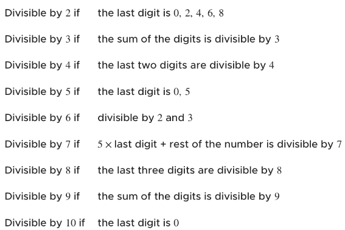

# Divisibility

The rules of divisibility are a shorthand way to determining whether a particular integer is divisible buy another without actually performing hte division:

# Multiples

When we think about divisibility we can consider multiples the second part of the same idea. When we divide we prove a multiple of a number by the fact the quotient is of the set of whole numbers. If we receive a Rational Number we know that the result has a remainder, in which case the number is not a factor of the divisor. A multiple on the other hand is one which we can calculate simply by working through the times tables. Any number which results from multiplying the integer in question.

It can be easy to confuse factors and multiples without thinking. Factors are those whole number quotients from dividing, multiples are the product of a multiplication.

There are several ways to classify integers; positive, negatives, 0, etc... additionally there are also prime and composite numbers. A number can either be prime or composite but can never be both.

# Prime Numbers

A prime number is a whole number greater than 1 that has no positive divisors other than 1 and itself. In other words, a prime number is a factor only of itself and 1. We already know every whole number is divisible by 1 as when we divide any whole number by 1 it has no bearing on the result e.g.: 10 / 1 = 1

Defining prime numbers is rather simplistic, however, efficiently working out whether a number is prime in code is a different story.

The first thing we can do is discount any number less than 2. A prime number must always be greater than 1 therefore anything less than 2 cannot possibly be prime.

<pre>
<code>
const isPrime = (number) => {
  if (number < 2) {
    return false;
  }
}
</code>
</pre>

This is a great start but we still need to work out our return value if the number is indeed greater than 2. To do so we need to loop over all the numbers up to the number we are checking right? We already know we don't need to check for factors greater than our number. Since prime numbers are divisible only by 1 and itself we actually don't even need to check up to the number in question, but the square root of said number. This is because of the fact factors always come in paris, if a number has a factor larger than its square root it must also have a corresponding small factor. By checking only up to the square root (the square root of a number is a value that when multiplied by itself gives the original number e.g. 3*3 = 0 thus the square root of 9 is 3) of the number we can effectively cover all possible factors.

<pre>
<code>
const isPrime = (number) => {
  if (number < 2) {
    return false;
  }
  const limit = Math.sqrt(number);
  for (let divisor = 2; divisor <= limit; divisor++) {
    if (number % divisor === 0) {
      return false;
    }
  }

  return true;
}
</code>
</pre>

We check if the number modulo the divisor is === 0 and if it is return false. This is because if we find an item in our search that is divisible by our number without a remainder then we have found a factor of the number, in that case we know that the number is divisible by more numbers than 1 and itself.

# Composite Numbers

In contrast to prime numbers composite numbers are numbers which are greater than 1 and are divisible by something other than just 1 or and themselves. An example of this would be 6 as it is divisible by 1, 2, and 3.

This means that to determine whether a number is prime or composite we need only determine whether the number is evenly divisible by a number other than 1 and itself. If the number divides evenly into any number evenly (other than 1 and itself) then we determine that the number is composite, otherwise it is prime.

This means, that in order to write a function which determines that a number is composite we can literally just negates `isPrime()`:

<pre>
<code>
  !isPrime(number);
</code>
</pre>

of course, we could always adapt our isPrime function instead.