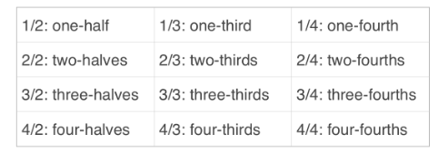

# Fractions

Fractions are what we call Rational Numbers. As we already know the set of all Rational Numbers are numbers which are representable by fractions, we classify them this way as they are the 'ratio' of integers. What does this mean? in simple terms if we were to take two integers: 5 and 7 for instance, we can represent a division of these numbers by a fraction:

<pre>
              5
             ---
              7
</pre>

we can read this as "5 divided by 7" or even "5 over 7". Fractions may look completely different to the numbers we are used to but the way we think about fractions is simple as a part of a whole. A fraction always as two numbers; the numerator, and the denominator. As the denominator is the item we are dividing by it is not possible to have a denominator of 0, after all, I can't have 5 out of 0 of an item as there isn't 5 in 0. The denominator can be thought of as the "total" and whole number of which we want a "piece" of. If I think of this in terms of a pie that I want to share with my friends we can think of it as:

<pre>
            5 pieces for me
            ---------------
            7 pieces in total
</pre>

that is a lot of pie... the fractions we have seen above are how we would traditionally write fractions, however, it is customary to write them as such: 5/7 when writing fractions in a line of text.

  

Percentages can be thought of as another representation of a fraction, when you hear "percent" you can simply think "divided by 100". This means that in order to turn a percentage value into a fraction we we can simply express it as a numerator of a whole: 56% = 56/100 = 0.56

This is the basics of fractions, embrace the simplicity! unfortunately, we also must learn to simplify fractions. This can be a bit more involved but the simplest example we can think of in this case is the fraction 50/100. We know that 100 represents a whole, this means we can rewrite this fraction as a part of a whole: 1/2, we know this as we know that a fraction 50/100 is a division of 50 by 100, equivalent to 0.50, we also know that 0.50 is half of a whole, hence: 50/100 = 1/2
We can also verify this by the mathematical fact that 100/2 is 50 and thus 50/100 is exactly 1/2 (or 50%) of 100.

So, what is the point in simplifying fractions? by simplifying fractions we can take much more complex fractions of greater quanta and simplify them into much more manageable numbers. If I take the fraction: 630/945 I can simplify it into 2/3 which is far easier handle. So, how do we go about simplifying this fraction: 630/945?
how do we know that the equivalent fraction is 2/3? This ties into our prime numbers.

First we find the prime factorisations of the numerator and the denominator

630

3 * 210

3 * 3 * 70

3 * 3 * 5 * 14

3 * 3 * 5 * 7 * 2

945

3 * 315

3 * 3 * 105

3 * 3 * 5 * 21

3 * 3 * 5 * 7 * 3

We then group together the factors that are common to the numerator and denominator:

<pre>
        630   (3 * 5 * 7) * 2
        --- = -------------------
        945   (3 * 3 * 5 * 7) * 3
</pre>

What we should remember here is that whenever a factor is common to both the numerator and denominator of a fraction that factor in the numerator cancels out the matching factor in the denominator. If the fraction is equal to the denominator the fraction does not simply disappear though so the fraction instead simplifies to:

<pre>
      3          10         67
      - = 1      -- = 1     -- = 1
      3          10         67
</pre>

Getting back to our problem, the numerator is not equal to our denominator but the factors (3 * 3 * 5 * 7) occur in both the numerator and denominator, thus those factors cancel out and we are left with only the 2 and the 3. Hence, the simplification results in 2/3.
