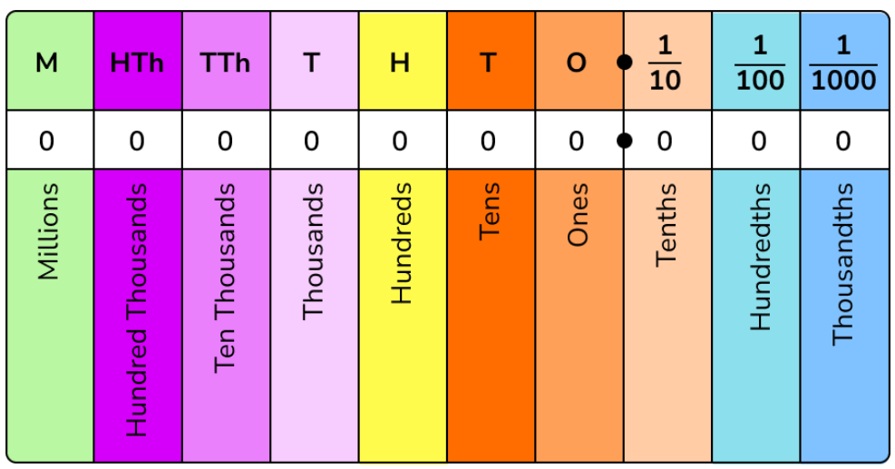
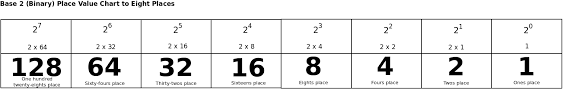
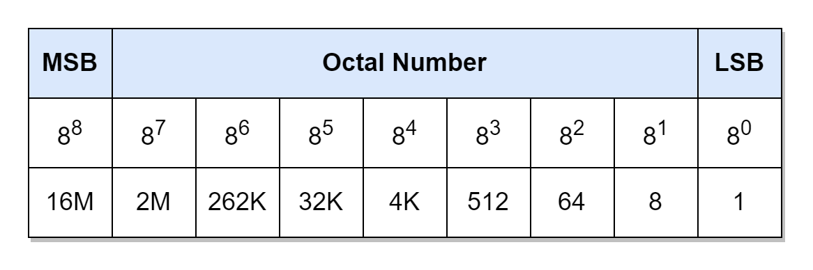

# Place Value

Place value systems have been used since the Babylonian and Mesopotamian civilisations. The decimal system uses a base 10 counting system in which we can represent each unit with 9 digits. We call this a place based system as the value of the digit is dependent on it's distance from the origin starting with our least units rightmost of the decimal point, to the larger values furthest to the left, this system works by multiplying each unit by 10 the further left we go, or dividing it by 10 the further to the right we go. This means that when we have the unit 1 in the ones section we are saying we have 1 of 1 or (1*1). If we multiply 1 by 10 we get 10, which gives us the tens column. Should we then have a number such as 2 in the 10s column we multiply that by 10 (20) thus if we put the 10s and 1s together: 20 + 1 = 21. This can continue for as long as we so please to create places in which to store values. If we instead move to the right and place a 5 in the tenths column we now see that we have a division: 5/10 = .5 and so on. This is a concept familiar to many and taught at a very low level to children in school, however. the same can be applied to number systems which cause even bachelors students a headache.

For example, if we take a look at a place value system for binary instead:

Here we can see similarities, only, rather than counting in 10s we are now counting in 2s. Instead of having 9 numbers to select from we have only 0 and 1. In the first column we have our 1s, since we may only use 0 or 1 we may only have no 1's or one 1. This continues down the line, notice how each time we are simply doubling our units, from our 1s we then have 2s, then 4s, then 8s and so on... this continues indefinitely. If we want to write a number in binary we simply "activate" the columns which are required to sum up to the result we desire. If I wanted the number 5: 101

This gives me one 4s, zero 2s, and one 1's: 4 + 0 + 1 = 5 thus 101 is representative of the decimal value 5. Lets look at another example: 3
to get this we see we need a 2 and a 1 so: 11 however, it is customary to add another 0 as not to confuse binary numbers with decimal numbers so: 011 is more accurate. We can omit zeros on the left, however, if the zeros are to the right we must provide them, just like we do in the decimal system, lest the number collapse to a different place value than intended. An example of this would be 129:
10000001

So, what other number systems can we apply this to? well.. the answer, is any number system which similarly uses a place value system, Octal for instance:

Here we have a base of 8 which means each unit is multiplied by 8 with powers going to the left just as in the binary system. What about HexaDecimal? Yes, it is important to recall that when we remember we only have access to certain symbols:

in octal: 0, 1, 2, 3, 4, 5, 6,7
in hexadecimal: 0,1,2,3,4,5,6,7,8,9,A,B,C,D,E,F

This is very much a quick and simplistic overview for revising the basic concepts, but I personally find this to be useful for remembering each system.