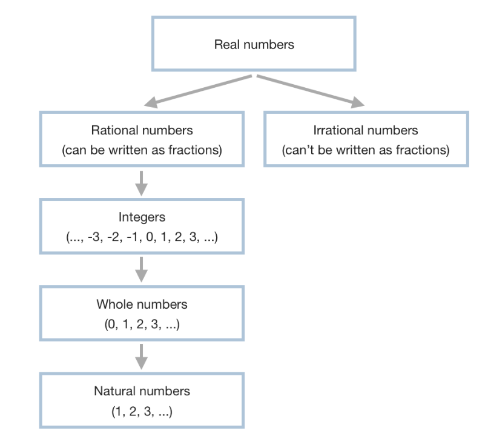

# What Are Numbers?

When we think of numbers, we usually think of whole numbers (1, 2, 3...). rarely do we think of other types of numbers which exist such as Rational Numbers (can be written as fractions, e.g. 0.25,0.3333'), Irrational Numbers (numbers which cannot be written as a fraction e.g. √10, infinite numbers like π) integers (...-2, -1, 0, 1, 2...) or natural numbers (1, 2, 3...).

These are all types of numbers that the entity we call the Real Numbers system is composed of:

Integers are a special type of rational number. We work with these in programming all the time. Integers consist to all the numbers you would normally think about (1, 2, 3, 4, 5), as well as zero and their negative counterparts.

Within the set of integer numbers is another set of numbers we call whole numbers, this is the set of all positive integers plus 0
(0, 1, 2, 3, 4, 5...).

Within the set of whole numbers is another set called the natural numbers. This set is composed of only positive integers without 0.

We often refer to natural numbers as "counting numbers" since 1, 2, 3, 4, 5... is often the fundamentals of how we learn to count when we are young.

Each Set of numbers is represented by a symbol:
	* R - the set of real numbers
	* Q - the set of rational numbers
	* Z - the set of integers
	* W - the set of whole numbers
	* N - the set of natural numbers
	* R-Q - the set of irrational numbers

Since the set of irrational numbers comprises of the set of all Real Numbers except the Rational Numbers. We usually express the se tof Irrational Numbers as R-Q or R\Q.

Sets can be applied to anything, not just numbers, for example, the set of programming languages might include:

ProgrammingLanguages = {PHP, Python, JavaScript, C++, C#, PERL, ...}

or the set of Planets in the solar system:

Planets = {Mercury, Venus, Earth, Mars, Jupiter, Saturn, Uranus, Neptune, Pluto}

We usually use curly braces to enclose the members of a given set.

Using this notation you may write out the sets of numbers as

N = {1, 2, 3, 4, 5, ...}
W = {0, N}
Z = {..., -5, -4, -3, -2, -1, W}
Q = {Z, 0.25, 0.5, 1/3, -7/2}
R = {Q}

R\Q = {√2, π, e, -e, ...}